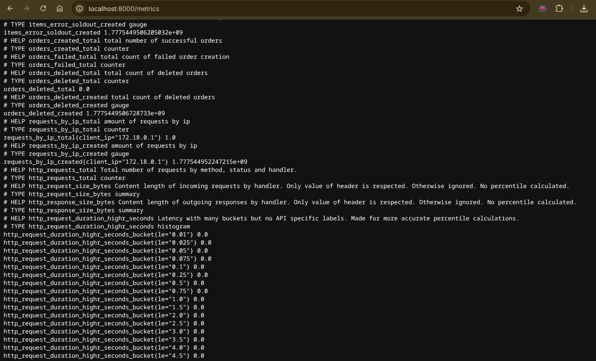
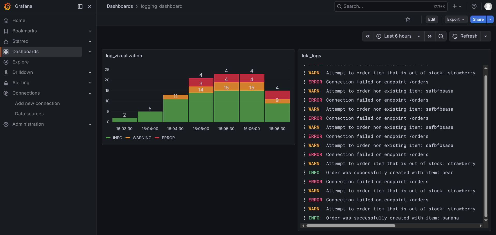
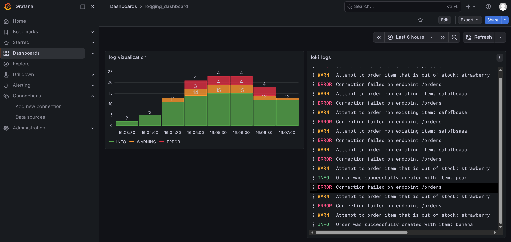
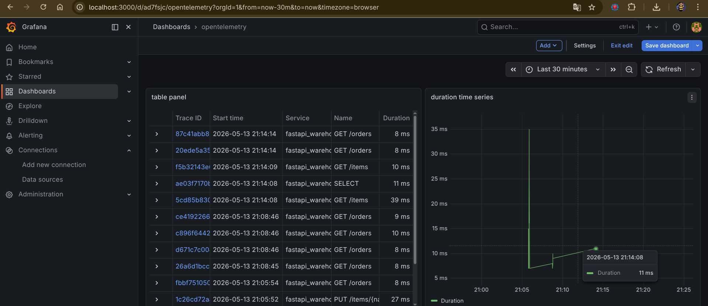
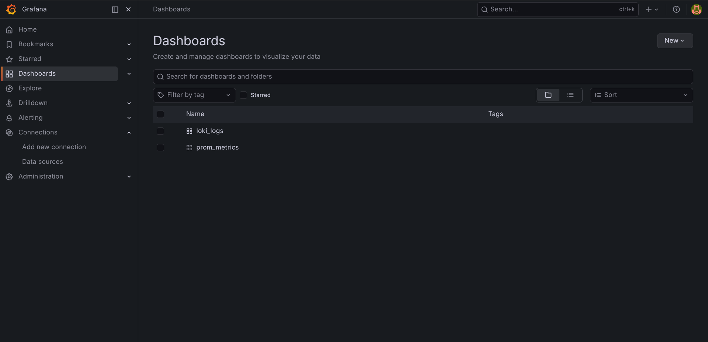

# data-processing

Бэкенд-сервис для управления складскими позициями и заказами, построенный на **FastAPI** и **SQLite**.

## Содержание

- [Возможности]()
- [Структура проекта]()
- [Требования]()
- [Запуск]()
- [API]()
- [База данных]()
- [Мониторинг, логирование и трассировка]()
- [Переменные окружения]()
- [CI/CD]()
- [Стек технологий]()

---

## Возможности

- CRUD-операции для складских **позиций (items)**
- Управление **заказами (orders)**
- Хранение данных в SQLite (`items.db`)
- Интерактивная документация API (Swagger UI / ReDoc)
- Экспорт метрик в Prometheus
- Логирование через Loki
- Распределенная трассировка через OpenTelemetry и Tempo
- Полная контейнеризация через Docker

---

## Структура проекта

```
data-processing/
├── warehouse/
│   ├── main.py              # Точка входа FastAPI-приложения
│   ├── db.py                # Подключение к БД и управление сессиями
│   ├── models.py            # ORM-модели SQLAlchemy
│   ├── schemas.py           # Pydantic-схемы запросов и ответов
│   └── routers/
│       ├── items.py         # Эндпоинты для позиций
│       └── orders.py        # Эндпоинты для заказов
├── Dockerfile
├── docker-compose.yml
├── openapi.yml              # Спецификация OpenAPI
├── prometheus.yml           # Конфигурация сбора метрик Prometheus
├── tempo.yml                # Конфигурация хранилища трейсов Tempo
├── start.sh                 # Стартовый скрипт для Docker
├── .gitlab-ci.yml           # Пайплайн CI/CD
├── requirements.txt
├── .dockerignore
└── .gitignore
```

---

## Требования

- Python 3.11+
- pip
- Docker и Docker Compose (для запуска в контейнере)

---

## Запуск

### Локально, без Grafana, Loki, Prometheus

```bash
git clone https://dev.cs.petrsu.ru/plugin/data-processing.git
cd data-processing

python -m venv venv
source venv/bin/activate

pip install -r requirements.txt

uvicorn warehouse.main:app --reload
```

API будет доступен по адресу `http://localhost:8000`.

### Через Docker

```bash
mkdir grafana_data
chmod -R 777 grafana_data
bash start.sh
```

---

## API

| Метод    | Путь           | Описание               |
| -------- | -------------- | ---------------------- |
| `GET`    | `/items`       | Список всех позиций    |
| `POST`   | `/items`       | Создать позицию        |
| `GET`    | `/items/{id}`  | Получить позицию по ID |
| `PUT`    | `/items/{id}`  | Обновить позицию       |
| `DELETE` | `/items/{id}`  | Удалить позицию        |
| `GET`    | `/orders`      | Список всех заказов    |
| `POST`   | `/orders`      | Создать заказ          |
| `GET`    | `/orders/{id}` | Получить заказ по ID   |

Интерактивная документация доступна по адресам:

- Swagger UI: `http://localhost:8000/docs`
- ReDoc: `http://localhost:8000/redoc`

---

## База данных

Приложение использует **SQLite**, файл базы данных хранится в корне проекта как `items.db`. Файл исключён из системы контроля версий через `.gitignore`.

При первом запуске таблицы создаются автоматически.

---

## Мониторинг, логирование и трассировка

Стек наблюдаемости построен на связке **Prometheus → Grafana** (метрики) и **Loki → Grafana** (логи) 
и **Tempo → Grafana** (распределенная трассировка).

### Prometheus

**Конфигурация (`prometheus.yml`):**

```yaml
global:
  scrape_interval: 15s

scrape_configs:
  - job_name: "data-processing"
    static_configs:
      - targets: ["app:8000"]   # имя сервиса из docker-compose
    metrics_path: /metrics
```

Метрики приложения доступны по адресу `http://localhost:8000/metrics`.

**Настроенные дашборды в Grafana (Prometheus):**

| Дашборд           | Описание                                                  | Ключевые метрики   |
| ----------------- | --------------------------------------------------------- | ------------------ |
| items_sold_charts | сумма всех проданных товаров, и товаров по отдельности    | `items_sold_total` |
| connection_by_ip  | отображает кол-во подключений от каждого ip за промежуток | `client_ip`        |

**Скриншот метрик:**

    

---

### Loki

**Настроенные дашборды в Grafana (Loki):**

| Дашборд   | Описание                                    | Ключевые запросы (LogQL)                                                                                                       |
| --------- | ------------------------------------------- | ------------------------------------------------------------------------------------------------------------------------------ |
| logs_text | Текстовый вариант всех логов                | `{application="fastapi_warehouse"} !~ "Connection recieved\|Connection successful"`                                            |
| logs_bars | Визуализация логов по интервалам и статусам | `sum by (response_code) (<br/>  count_over_time({application="fastapi_warehouse", response_code=~"200\|400\|404"}[30m])<br/>)` |

**Скриншоты дашборда логов:**

<!-- Добавьте скриншот после настройки: docs/screenshots/loki-dashboard.png -->



---

### OpenTelemetry + Tempo (Трассировка)

Система отслеживает полный жизненный цикл запроса — от HTTP-вызова к FastAPI до конкретного SQL-запроса в SQLite.
* сбор данных происходит автоматически (библиотеки fastapi и sqlite3), не затрагивая бизнес-логику;
* экспорт спанов идет в фоновом режиме батчами по протоколу OTLP;
* системный трафик (запросы Prometheus к /metrics) автоматически исключен из трейсов

**Настроенные дашборды в Grafana (Tempo):**

| Дашборд            | Описание                                    | Ключевые запросы (TraceQL)                                                                      |
| ------------------ | ------------------------------------------- | ----------------------------------------------------------------------------------------------- |
| table panel       | Список последних запросов в виде таблицы    | `{resource.service.name="fastapi_warehouse" && traceDuration>8ms && (name!="GET /metrics" && name!="GET /metrics http send")}`                           |
| duration time series | График времени выполнения запросов          | `{duration>5ms && (name!="GET /metrics" && name!="GET /metrics http send") && resource.service.name="fastapi_warehouse"}`     |

**Скриншот трейсов:**



---

### Grafana



Доступ по http://localhost:3000, логин/пароль по умолчанию - admin/admin

**Источники данных (Data Sources):**

| Имя        | Тип        | URL                      |
| ---------- | ---------- | ------------------------ |
| Prometheus | Prometheus | `http://prometheus:9090` |
| Loki       | Loki       | `http://loki:3100`       |
| Tempo      | Tempo      | `http://tempo:3200`      |

---

## Переменные окружения

| Переменная     | Значение по умолчанию  | Описание            |
| -------------- | ---------------------- | ------------------- |
| `DATABASE_URL` | `sqlite:///./items.db` | Путь к файлу SQLite |

---

## CI/CD и Автоматизация (GitLab CI)

В репозитории настроен автоматический конвейер непрерывной интеграции (CI) для проверки качества кода и стабильности работы склада. Пайплайн запускается автоматически при каждом пуше в репозиторий и состоит из следующих последовательных стадий:

1. **Lint (`lint`)**
   * **Инструмент:** `ruff`
   * **Назначение:** Молниеносный статический анализ кода на соответствие стандартам PEP 8, поиск неиспользуемых импортов, дубликатов функций и синтаксических ошибок. Запускается первым для экономии ресурсов раннера.
2. **Run Default (`run_default`)**
   * **Назначение:** Дымовое тестирование (Smoke test). Проверяет, что приложение FastAPI успешно инициализируется и импортируется без критических ошибок на этапе старта.
3. **Test Logic (`test_logic`)**
   * **Инструмент:** `pytest` + `TestClient` (`httpx`)
   * **Назначение:** Запуск сквозных интеграционных тестов для проверки бизнес-логики склада (`/items`) и заказов (`/orders`).
   * **Особенности изоляции:**
     * База данных: Перед запуском тестов автоматически вызывается асинхронная фикстура, которая генерирует чистую структуру таблиц в SQLite с нуля.
     * Мониторинг: Сетевая активность OpenTelemetry (Tempo) принудительно глушится через переменные окружения (`OTEL_SDK_DISABLED`), чтобы тесты в изолированной среде CI не падали по таймауту.

### Локальный запуск проверок

Рекомендуется запускать проверку кода локально перед отправкой коммита в репозиторий:

```bash
# Проверка кода линтером
ruff check warehouse/ tests/

# Запуск интеграционных тестов
python -m pytest tests/ -v

---

## Стек технологий

- [FastAPI](https://fastapi.tiangolo.com/) — веб-фреймворк
- [SQLAlchemy](https://www.sqlalchemy.org/) — ORM
- [Pydantic](https://docs.pydantic.dev/) — валидация данных
- [Uvicorn](https://www.uvicorn.org/) — ASGI-сервер
- [SQLite](https://www.sqlite.org/) — база данных
- [Prometheus](https://prometheus.io/) — сбор метрик
- [Loki](https://grafana.com/oss/loki/) — агрегация логов
- [OpenTelemetry](https://opentelemetry.io/) — сбор и экспорт трассировки
- [Tempo](https://grafana.com/docs/tempo/) — хранилище трейсов
- [Grafana](https://grafana.com/) — визуализация метрик и логов
- [Docker](https://www.docker.com/) — контейнеризация
- [GitLab CI/CD](https://docs.gitlab.com/ci/) - continuous integration
